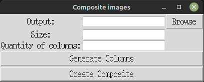
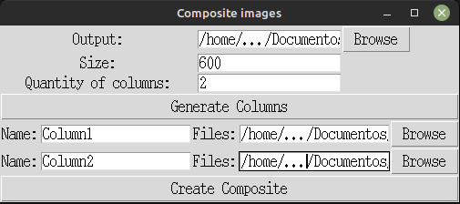
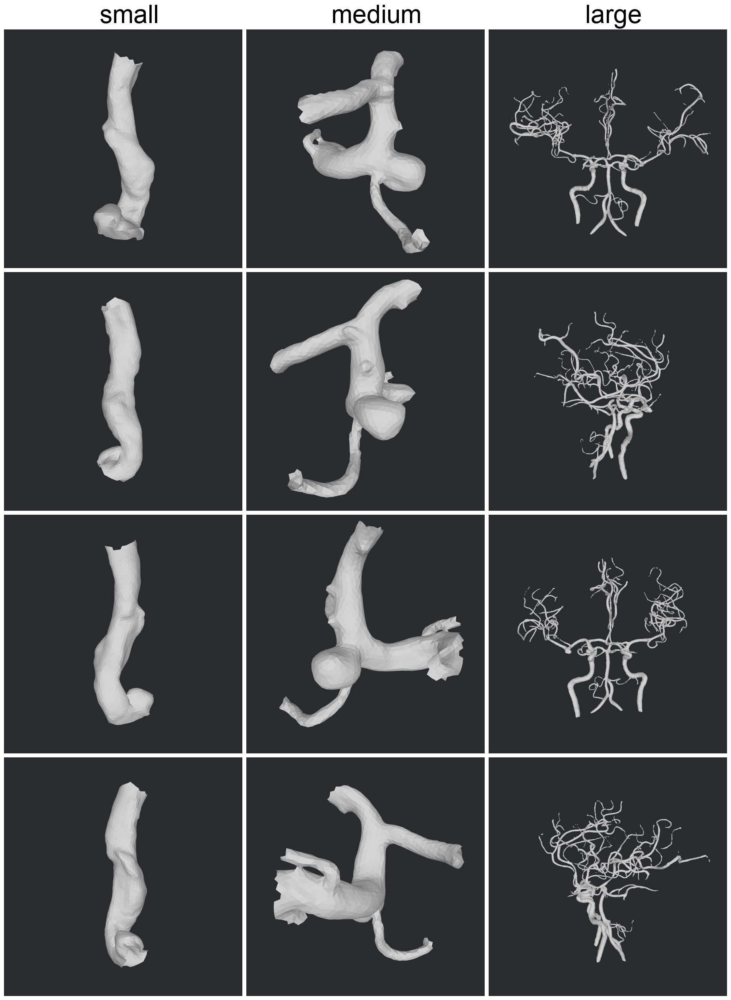

# Composite Images by Herre

This is an application to create composite images to compare between them. 
Images are distributes as columns within names.

Use it for your needs.

## How to use it

Clone the repo, then:

``` bash
pip install -r requirements.txt
```

use main.py with the config file to use it as a python script

``` bash
python main.py
```

Or can use the ui:
``` bash
python app.py
```

Also you can download the executable for your OS (Linux(debian based), macOS, Windows) in the realese section

## Motivation (28/06/2024)
I'm currently writing my thesis for my Software Engineering career, and when I have to compare some images, I cannot add and composite them in columns for comparison. So, I created this app to solve that problem and also to reinforce my knowledge in GitHub Actions, specifically in CI/CD pipelines and releases.

## App previews


## Example results

